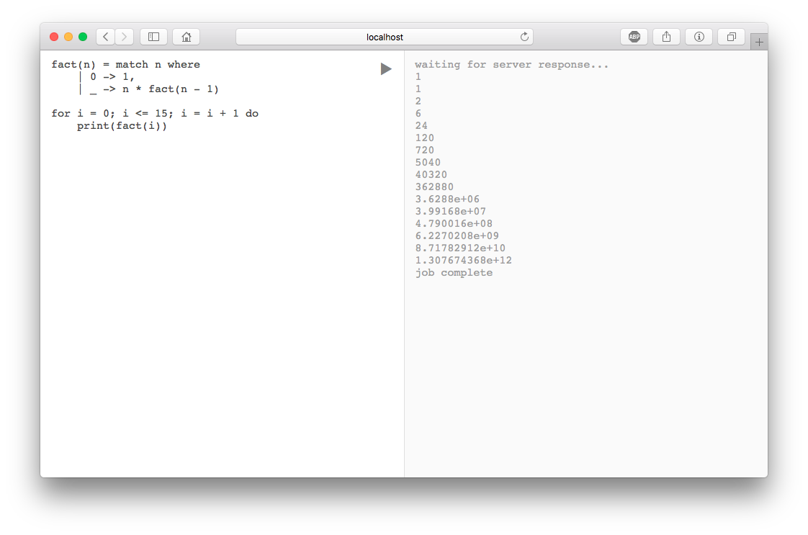

# Radon Playground

An online code-runner for the Radon language. Currently, it supports the
execution of arbitrary Radon code, however there are certainly areas for
improvement:

 - Timeout, maybe of about 5 minutes
   - Would involve adding some kind of interrupt system to the Radon
   	 virtual machine.
 - A job queue
   - Queues a number of jobs, maybe up to 32?, and won't execute more than
	 that amount simultaneously. To reduce load on the server.
 - Option to either print the AST, the bytecode, or execute the program.
 - A URL query parameter to set options
   - e.g. `?job=ast` would print the AST, and `?job=exec` would execute the program.
   - This would be useful so the app can be embedded (iframe) in other sites.
 - Syntax highlighting
 - Some example programs
