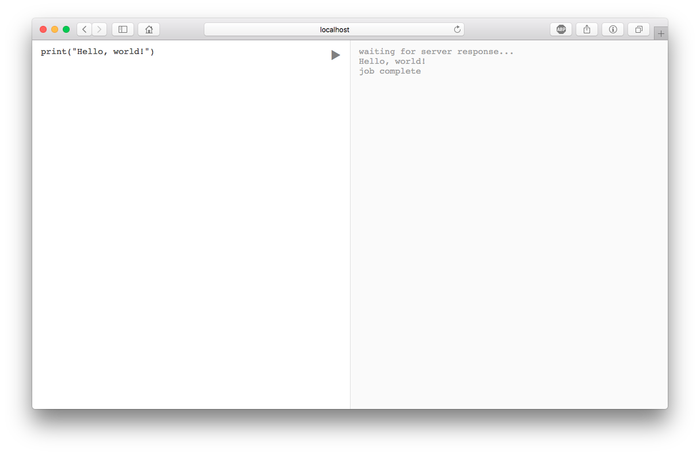

# Radon Playground

An online code-runner for the Radon language. Currently, it supports the
execution of arbitrary Radon code, however there are certainly areas for
improvement:

 - Timeout, maybe of about 5 minutes
   - Would involve adding some kind of interrupt system to the Radon
   	 virtual machine.
 - A job queue
   - Queues a number of jobs, maybe up to 32?, and won't execute more than
	 that amount simultaneously. To reduce load on the server.
 - Option to either print the AST, the bytecode, or execute the program.
 - Syntax highlighting
 - Some example programs

## Parsing and compiling

As well as executing the program, you can tell it to just parse or compile
it. This is done using the URL parameter, `?job=<job>`. `<job>` can be either
`ast`, `bytecode`, or `exec`. (Technically, anything which isn't `ast` or
`bytecode` is interpreted as `exec`.)

	
